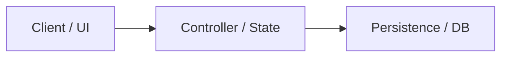

# Plan: <Feature / Architecture Name>

> **Status:** draft | approved | in-progress | completed | superseded  
> **Created:** YYYY-MM-DD  
> **Updated:** YYYY-MM-DD  
> **PRD:** [PRD Index](../prd/0000-prd-index.md) (or link affected PRD)  
> **Associated Tasks:** [Task Board](../tasks/README.md) (or link active tasks)  

---

## 1. Objective & Technical Scope

A clear summary of what technical capability is being designed, the affected subsystems, and key constraints.

---

## 2. Architecture & Data Flow

Describe components, interfaces, state management, and data contracts.

---

## 3. Detailed Milestones & Breakdown

- [ ] **Milestone 1**: Core Data Structures & Models
- [ ] **Milestone 2**: API / Engine Integration
- [ ] **Milestone 3**: UI / Interaction Layer
- [ ] **Milestone 4**: Automated Verification & Edge Cases

---

## 4. Risks & Mitigations

- **Risk**: Description of technical risk.
  - *Mitigation*: Mitigation strategy.

---

## 5. Verification Strategy

- Automated tests: commands and test scenarios.
- Manual verification: edge cases and performance characteristics.
